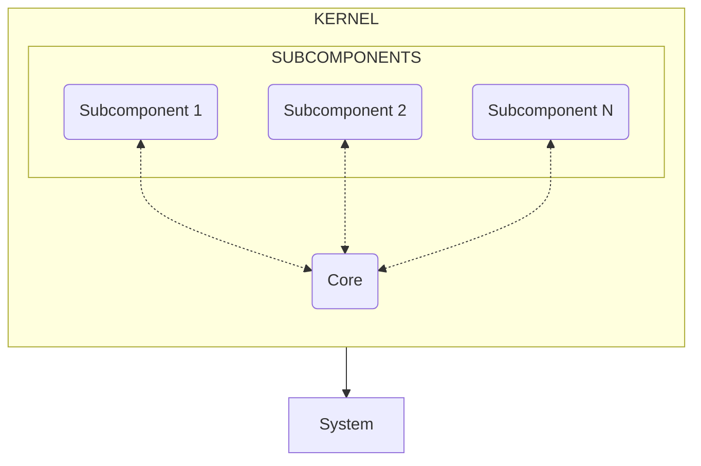

# Kernel Core

## Introduction

Core es uno de los componentes principales que, a diferencia de los subcomponentes, no se centra ni en la obtencion
de resultados ni el el trato de ellos, sino que se encarga de gestionar aquellos datos que son globales al framework
y por lo tanto no pueden ser privatizados en un componente especifico. Esta funcionalidad puede ser util para ciertas
acciones que necesitan datos que no pertenecen al dominio de cierto subcomponente en concreto pero sean necesarios para
realizar dicha acción. Es por ello que, para evitar insertar dependencias innecesarias en los subcomponentes, se ha
creado Core como bus interno de datos globales.

Por ejemplo, el subcomponente encargado de ofrecer la Activty actual, no debe conocer el sistema de obtencion de la
Activity actual ni debería saber quien es el encargado de ello. Ahi entra en juego Core, ya que es el encargado de
otorgar esos datos a los subcomponentes que lo necesiten, abstrayendolos de la complejidad de la obtencion de dichos datos.

!!! note "Nota"
    Core no conoce todos los subcomponentes del kernel, tan solo se centra en la conexion de datos entre ellos.

## Estructura

[//]: # (todo Especificar mejor la estructura de Core)