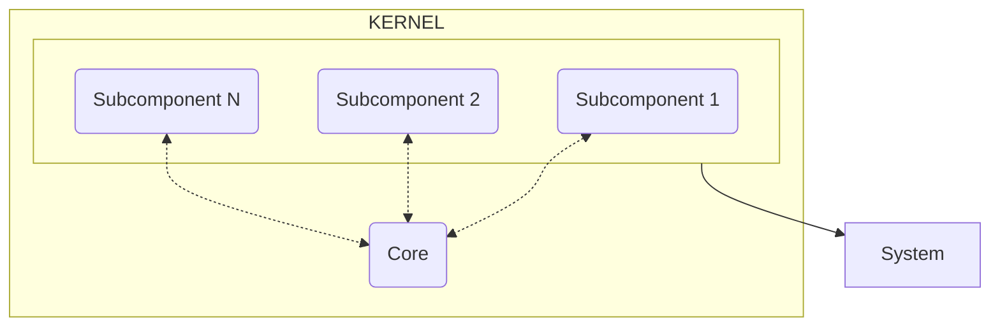

# Kernel Core

## Introduction

Core es uno de los componentes principales que, a diferencia de los subcomponentes, no se centra ni en la obtencion
de resultados ni el el trato de ellos, sino que se encarga de gestionar aquellos datos que son globales al framework
y por lo tanto no pueden ser privatizados en un componente especifico. Esta funcionalidad puede ser util para ciertas
acciones que necesitan datos que no pertenecen al dominio de cierto subcomponente en concreto pero sean necesarios para
realizar dicha acción. Es por ello que, para evitar insertar dependencias innecesarias en los subcomponentes, se ha
creado Core como bus interno de datos globales.

Por ejemplo, el subcomponente encargado de ofrecer la Activty actual, no debe conocer el sistema de obtencion de la
Activity actual ni debería saber quien es el encargado de ello. Ahi entra en juego Core, ya que es el encargado de
otorgar esos datos a los subcomponentes que lo necesiten, abstrayendolos de la complejidad de la obtencion de dichos datos.

!!! note "Nota"
    Core no conoce los subcomponentes del kernel, tan solo se centra en la conexion de datos entre ellos.

## Estructura

[//]: # (todo Especificar mejor la estructura de Core)

Para maximizar la independencia de core respecto a los subcomponentes, se hace uso de un enum, `CoreKeys`, que contiene
las claves de los datos que se pueden obtener de otros subcomponentes. De esta forma, los subcomponentes no necesitan
conocer la estructura de Core, tan solo necesitan conocer la clave del dato que necesitan y Core se encarga de obtenerlo
de forma activa. Para ello, Core espera que en algun momento de la configuracion del kernel, se suscriban a cada _key_ los
subcomponentes que puedan ofrecer dicho dato. 

### Suscripcion de datos

Ya mencionado anteriormente, Core no conoce los subcomponentes del kernel, por lo que emplea un sistema de suscripcion
para que los subcomponentes puedan ofrecer sus datos a Core. Para ello, Core expone un metodo, `subscribe`, que recibe
como parametro la clave del dato que se desea suscribir y un callback que se ejecutara cuando se solicite dicho dato.

[//]: # (todo Añadir ejemplo de suscripcion de datos)

### Obtencion de datos

Para obtener los datos, Core expone un metodo, `get`, que recibe como parametro la clave del dato que se desea obtener.
Este metodo se encarga de buscar en el mapa de suscripciones si existe algun subcomponente que ofrezca dicho dato, y en
caso de que exista, ejecuta el callback asociado a dicho dato, recupera el dato y lo devuelve. En caso de que no exista
una suscripcion asociada a la clave, se lanza una excepcion.

[//]: # (todo Añadir ejemplo de obtencion de datos)

