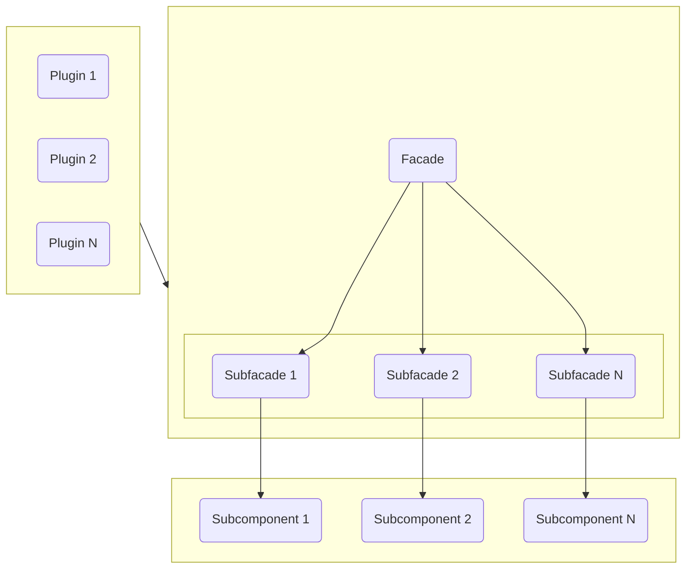

# Kernel Facade

El Kernel Facade es el componente que se encarga de gestionar las llamadas de los modulos
al kernel, y de gestionar las respuestas del kernel a los modulos. Basicamente es un
intermediario entre los modulos y el kernel, que se encarga de que la comunicacion entre
ambos sea correcta y lo mas sencilla posible de cara a los modulos y el usuario final.

## Funcionamiento

El funcionamiento del Kernel Facade es muy sencillo. Basicamente se encarga de gestionar
las llamadas de los modulos a los componentes del kernel y viceversa, de forma que los
modulos no tengan que preocuparse de saber como se comunican con el kernel. Para ello,
el Kernel Facade expone una serie de metodos que los modulos pueden utilizar para
comunicarse con los componentes internos, ya que la principal funcion del Kernel Facade es la de
abstraer a los modulos de la complejidad de la comunicacion con los componentes del kernel y 
evitar la necesidad de saber y depender de como funciona internamente el framework.

## Estructura

!!! info   
    Se puede observar que el Kernel Facade esta compuesto por un conjunto de subfacade, los cuales
    se encargan de gestionar las llamadas a los componentes internos del kernel. Esta subdivision se debe
    a que el Kernel Facade es un componente muy complejo, por lo que se ha decidido dividirlo en
    subfacade para facilitar su comprension y mantenimiento.

[//]: # (todo seguir con la estructura del facade)