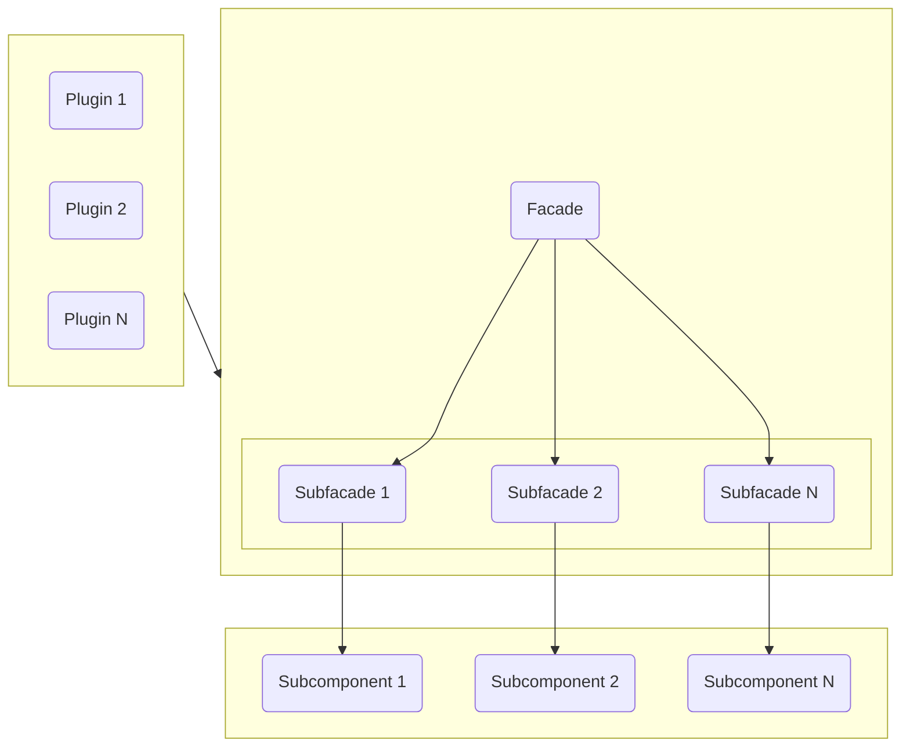

# Facade

The Kernel Facade is the component responsible for managing the communication between modules and the kernel, as well as
handling the kernel's responses to the modules. Essentially, it acts as an intermediary between the modules and the
kernel, ensuring that communication is smooth and as simple as possible for both the modules and the end user.

## Functionality

The operation of the Kernel Facade is straightforward. It handles the communication between modules and kernel
components, and vice versa, so that the modules do not need to worry about how they interact with the kernel. To achieve
this, the Kernel Facade exposes a set of methods that the modules can use to communicate with the internal components.
The primary function of the Kernel Facade is to abstract the complexity of kernel communication from the modules,
allowing them to avoid needing to understand or depend on the internal workings of the framework.

## Structure

!!! info   
    The Kernel Facade is composed of a set of subfacades, each responsible for managing communication with specific internal
    kernel components. This subdivision exists because the Kernel Facade is a highly complex component, and splitting it
    into subfacades helps improve its comprehensibility and maintainability.

