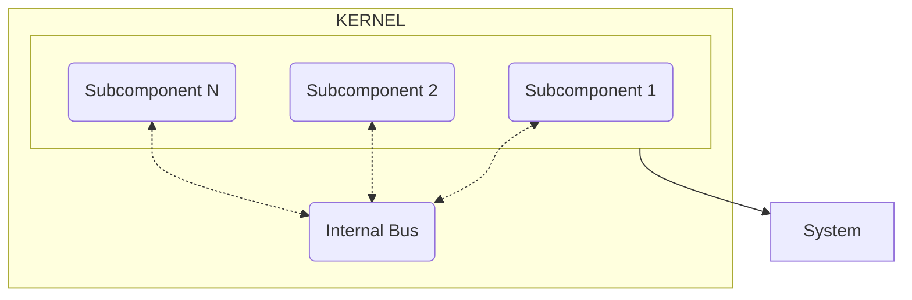

# Internal Bus

## Introduction

The `Internal Bus` is one of the core components that, unlike subcomponents, does not focus on obtaining or processing
results. Instead, it is responsible for managing data that is global to the framework and, therefore, cannot be
privatized within a specific component. This functionality is useful for actions that require data not belonging to a
particular subcomponent but are necessary to perform a given task. To avoid inserting unnecessary dependencies into
subcomponents, the `Internal Bus` was created as an internal bus for global data.

For example, the subcomponent responsible for providing the current `Activity` should not know the system used to obtain
it, nor should it be aware of who is responsible for it. This is where the `Internal Bus` comes into
play, as it provides these data to the subcomponents that need them, abstracting them from the complexity of obtaining
the data.

???+ note
    `Internal Bus` does not know the kernel subcomponents; it only focuses on connecting data between them.

## Structure

To maximize the independence of the `Internal Bus` from subcomponents, an enum called `Keys` is used. This enum contains
the keys for the data that can be obtained from other subcomponents. This way, subcomponents do not need to know the
structure of the Internal Bus, they only need to know the key for the data they require, and the `Internal Bus` takes
care of actively retrieving it. For this, `Internal Bus` expects subcomponents that can provide the data to subscribe to
each `key` during the kernel configuration process.

### Data Subscription

As previously mentioned, the Internal Bus does not know the kernel subcomponents, so it uses a subscription system to
allow subcomponents to offer their data to the `Internal Bus`. For this, the `Internal Bus` exposes a method, `subscribe`,
which takes as parameters the key of the data to be subscribed and a callback that will be executed when the data is
requested.

### Data Retrieval

To retrieve data, the Internal Bus exposes a method, `get`, which takes as a parameter the key of the data to be
obtained. This method searches the subscription map to check if any subcomponent provides the requested data. If it
exists, the associated callback is executed, the data is retrieved, and returned. If no subscription is associated with
the key, an exception is thrown.
