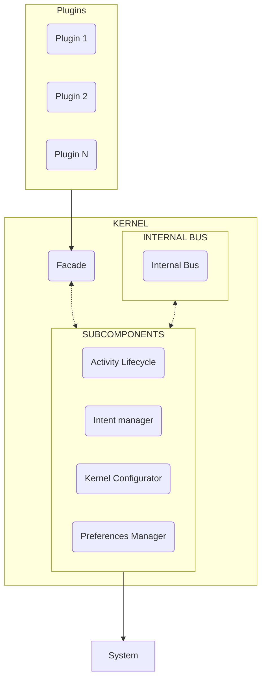

# ModuleDroid Kernel

## Introduction

???+ info
    The ModuleDroid kernel documentation is intended for those who wish to develop modules or
    plugins for the framework or want to learn more about its inner workings. It is not necessary to understand the
    internal
    operation of the kernel to use the framework.

ModuleDroid is based on a system of modules or plugins, where each one is independent of the rest and can be added
or removed from the system at any time. The system consists of a core (kernel) that manages the modules and plugins
running in the system, as well as the events that occur within it.

Internally, the kernel is composed of a set of components responsible for managing different aspects of the system. If a
module needs to interact with any system functionality, it does so through the kernel, which then handles the
interaction with the corresponding component.

 

## Plugins

Plugins are modules that operate independently of the kernel, meaning they can be added or removed from the application
at any time without affecting other modules.

???+ note
    It is possible to create plugins that rely on other plugins as dependencies; however, this practice should be minimized
    to maintain the independence of each plugin as much as possible.

Plugins communicate with the kernel via the Facade component, allowing the plugin to remain abstracted from the kernel's
internal implementation and only interact with the core through a defined interface.

## Kernel

The kernel is the core of the framework, responsible for managing the modules or plugins running in the system and
handling the events that occur within it. Internally, the kernel consists of a set of components that manage various
aspects of the system. If a module needs to interact with any system functionality, it communicates with the kernel,
which then handles the interaction with the appropriate component.

???+ warning
    The kernel utilizes a customized `Application` class. If, for any reason, there is a need to implement a custom
    Application, it is important to consider that the kernel may not function
    correctly. To minimize potential incompatibilities, it is recommended to extend from `ModuleDroidApplication`
    in the `Kernel Configurator` subcomponent and to call the `super` method within the `onCreate` method.
  
???+ warning
    The kernel runs on the main thread of the application, so blocking code should not be executed within it.

???+ warning
    Accessing any aspect of the system by bypassing the kernel may result in unexpected behavior.
    It is recommended to avoid this practice. If access to a system functionality not implemented in the kernel is
    required,
    please notify the development team to consider adding it to the kernel or provide an alternative solution.

## Components

As previously mentioned, the kernel is composed of a set of components responsible for managing and facilitating access to different aspects of the system.

Below are the components that make up the kernel:

::cards:: cols=2

- title: Facade  
  content: Manages calls to subcomponents from plugins  
  url: ../components/facade_kernel/

- title: Internal Bus  
  content: Manages communication between kernel subcomponents  
  url: ../components/internal_bus/

::/cards::

---

::cards:: cols=2

- title: Activity Lifecycle  
  content: Manages events subscribed to the activity lifecycle  
  url: ../components/subcomponents/activity_lifecycle/

- title: Intent Manager  
  content: Manages events related to intents  
  url: ../components/subcomponents/intent_manager/

- title: Kernel Configurator  
  content: Manages events related to kernel configuration  
  url: ../components/subcomponents/kernel_configurator/

- title: Preferences Manager  
  content: Manages events related to preferences  
  url: ../components/subcomponents/preferences_manager/

::/cards::

[//]: # (todo añadir los componentes del kernel)
