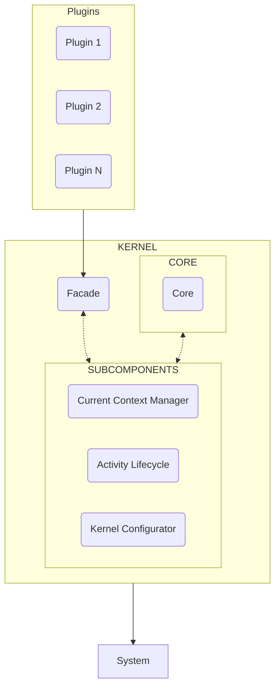

# ModuleDroid Kernel

## Introduction

> :material-information: La documentacion del kernel de ModuleDroid esta pensada para aquellos
> que desean desarrollar modulos o plugins para el framework o quieren saber mas sobre el
> funcionamiento del mismo. No es necesario conocer el funcionamiento interno del kernel
> para utilizar el framework.

ModuleDroid esta basado en un sistema de modulos y plugins, de forma que cada modulo
es independiente del resto, y puede ser añadido o eliminado del sistema en cualquier momento.
Para ello, el sistema esta compuesto por un nucleo (kernel) que se encarga de gestionar
los modulos y plugins que se ejecutan en el sistema, asi como de gestionar los eventos
que se producen en él. 

Internamente, el kernel esta compuesto a su vez por un conjunto de componentes que se encargan
de gestionar los diferentes aspectos del sistema, de forma que si un modulo necesita interactuar
con un aspecto del sistema, lo hace a traves del kernel y este se encarga de gestionar la
interaccion con el componente correspondiente.

 

[//]: # (todo añadir los nuevos componentes a los subcomponentes del kernel)

## Plugins
Los plugins son modulos que se ejecutan de forma independiente al kernel, de forma que
pueden ser añadidos o eliminados de la aplicacion en cualquier momento sin afectar al resto
de modulos. 

Para ello, los plugins se comunican con el kernel a traves del componente Facade, de 
forma que el plugin se absrae de la implementacion interna del kernel y solo se comunica
con el nucleo a traves de una interfaz.

## Kernel
El kernel es el nucleo del framework, por lo que es el encargado de gestionar los modulos o plugins
que se ejecutan en el sistema, asi como de gestionar los eventos que se producen en él.
Internamente, el kernel esta compuesto a su vez por un conjunto de componentes que se encargan de
gestionar los diferentes aspectos del sistema, de forma que si un modulo necesita interactuar
con un aspecto del sistema, lo hace a traves del kernel y este se encarga de gestionar la
interaccion con el componente correspondiente.

> :material-alert: El kernel es un componente que se ejecuta en el hilo principal de la aplicacion,
> por lo que no se debe ejecutar codigo bloqueante en él.
<!-- Separador -->
> :material-information: Acceder a algun aspecto del sistema sorteando el kernel puede provocar
> comportamientos inesperados en el sistema, por lo que se recomienda no hacerlo. Si se necesita acceder a algun aspecto del sistema no implementado en el kernel, se recomienda notificar al
> equipo de desarrollo para que baraje la posibilidad de añadirlo al kernel o otorgen alguna solucion
> alternativa.

## Componentes
Como se ha comentado anteriormente, el kernel esta compuesto por un conjunto de componentes
que se encargan de gestionar y facilitar el acceso los diferentes aspectos del sistema. 

A continuación detallamos los componentes que componen el kernel:

[:material-guy-fawkes-mask: Facade](../components/facade_kernel/){ .md-button .mine-rounded}  

[:material-chip: Core](../components/core/){ .md-button }  

[:material-nut: Current Context Manager](../components/secondary%20components/current_context_manager/){ .md-button }  

[:material-sync: Activity Lifecycle](../components/secondary%20components/activity_lifecycle/){ .md-button }  

[:material-wrench-cog: Kernel Configurator](../components/secondary%20components/kernel_configurator/){ .md-button }  

[//]: # (todo añadir los componentes del kernel)
